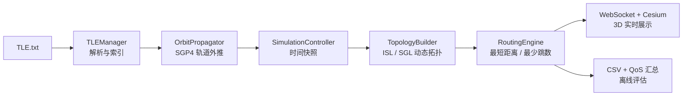

# NTN-TN 异构网络动态路由仿真平台

这是一个面向非地面网络（NTN）与地面网络（TN）的动态拓扑与路由仿真项目。项目读取本地 TLE 数据，使用 Skyfield/SGP4 外推卫星轨道，在每个时间快照中构建星间链路（ISL）和星地链路（SGL），再通过 NetworkX 计算端到端路由、传播时延和路由切换情况。

项目提供两种运行方式：

- **Web 3D 实时模式**：FastAPI + WebSocket 向 Cesium 页面持续推送卫星、地面站、拓扑和当前路由。
- **离线仿真模式**：在命令行执行完整时间窗口的仿真，导出 CSV，并打印 QoS 汇总报告。

## 主要功能

- 兼容两行式和三行式 TLE 数据。
- 基于 Skyfield 的 SGP4/SDP4 轨道外推，输出 WGS84 经纬度和高度。
- 基于三维 KD-Tree、最大链路距离和地球遮挡条件构建星间链路。
- 按最小仰角构建地面站到卫星的星地链路。
- 支持“最短物理距离”和“最少跳数”两种路由策略。
- 统计端到端物理距离、单向传播时延、跳数和路由切换。
- 离线模式包含简化的日照/地影与卫星电量模型。
- 通过 Cesium 展示卫星、地面站、动态链路和高亮活动路由。

## 工作流程



## 项目结构

| 文件 | 作用 |
| --- | --- |
| `main.py` | FastAPI、WebSocket、Cesium 单页前端和 Web 实时仿真入口 |
| `simulation_controller.py` | 组织轨道预计算、逐帧拓扑、路由、电量模型、CSV 导出和汇总报告 |
| `tle_manager.py` | 解析两行式/三行式 TLE，并创建卫星传播器 |
| `orbit_propagator.py` | 使用 Skyfield 将 TLE 外推为按时间索引的经纬高数据 |
| `topology_builder.py` | 构建包含 ISL 和 SGL 的 NetworkX 无向图 |
| `routing_engine.py` | 计算最短距离或最少跳数路径及传播时延 |
| `visibility_analyzer.py` | 独立的批量星间视线可见性分析工具 |
| `TLE.txt` | 项目内附的两行式 TLE 数据样例 |
| `routing_simulation_report.csv` | 已生成的一次离线仿真结果样例 |
| `TECHNICAL_NOTES.md` | 算法、数据结构、模式差异和已知限制 |

## 环境要求

- Python 3.10 或更高版本（当前项目已在 Python 3.12.7 下完成基础检查）
- 能访问 Cesium CDN 和 Cesium World Terrain 的网络环境（仅 Web 3D 模式需要）

安装依赖：

```bash
python -m pip install fastapi uvicorn pydantic pandas numpy networkx scipy skyfield
```

本项目目前没有 `requirements.txt` 或锁文件，上面的命令来自代码中的实际导入项。当前检查环境使用的主要版本见 [TECHNICAL_NOTES.md](TECHNICAL_NOTES.md#已检查环境)。

## 运行前检查：TLE 路径

`main.py` 和 `simulation_controller.py` 的可执行入口目前都使用以下绝对路径：

```text
C:\Users\dongh\Desktop\shixi\TLE.txt
```

而本项目目录内也有一份 `TLE.txt`。因此：

- 当前代码默认读取的是上面绝对路径对应的文件，不是项目目录内的相对路径文件。
- 在其他电脑或目录运行时，需要先把 TLE 文件放到该绝对路径，或由维护者将入口中的 `REAL_TLE_FILE` 改成实际路径。
- TLE 对时间敏感，仿真时间距离 TLE 历元越远，轨道结果通常越不可靠。正式实验前应更新数据并记录来源与获取时间。

## 启动 Web 3D 仿真

在项目根目录执行：

```bash
python -m uvicorn main:app --reload
```

浏览器访问：

```text
http://localhost:8000
```

页面会显示：

- 青色卫星节点与绿色地面站节点；
- 当前时间快照中的星间/星地拓扑；
- 橙色高亮的活动路由；
- 连通状态、单向传播时延和跳数；
- 通信源、目的端和路由策略选择器。

Web 模式默认使用 50 颗卫星、60 分钟仿真窗口、1 秒仿真步长、5000 km 最大 ISL 距离、每颗卫星最多 6 条 ISL，以及 15° 的最小星地链路仰角。每个 1 秒仿真快照约每 0.1 秒推送一次，因此页面播放速度约为 10 倍实时速度。

> 页面中的 WebSocket 地址固定为 `ws://localhost:8000/ws`。如果改用其他主机、端口或 HTTPS 反向代理，前端连接地址也需要同步调整。

## 运行离线仿真

执行：

```bash
python simulation_controller.py
```

默认场景为：

- 源节点：`GS-Beijing`
- 目的节点：`GS-Singapore`
- 路由策略：`shortest_distance`
- 仿真时长：60 分钟
- 步长：1 秒
- 最大 ISL 距离：6000 km
- 每颗卫星最多 6 条 ISL

运行完成后会覆盖生成 `routing_simulation_report.csv`，并在终端打印连通率、最大连续中断、时延、抖动、P99 时延、跳数和路由切换等统计信息。

如需更换源/目的节点、策略或其他参数，目前需要在 `simulation_controller.py` 的 `__main__` 配置区调整。支持的策略值为：

| 策略 | 含义 |
| --- | --- |
| `shortest_distance` | 使用边的物理距离作为权重，选择总距离最短的路径 |
| `min_hops` | 忽略边权重，选择跳数最少的路径 |

## CSV 输出字段

| 字段 | 含义 |
| --- | --- |
| `timestamp` | UTC 仿真时间戳 |
| `is_success` | 当前快照中是否存在端到端路径 |
| `is_handover` | 与上一条成功路径相比是否发生路由切换 |
| `hops` | 成功路径的链路跳数 |
| `distance_km` | 成功路径的总物理距离，单位 km |
| `delay_ms` | 按真空光速估算的单向传播时延，单位 ms |
| `path_str` | 以 ` -> ` 连接的完整路径 |

仓库现有样例报告包含 3601 个时间快照，其中 1028 个快照连通、发生 9 次路由切换；这些数字只描述该文件记录的那一次运行，不代表所有配置下的结果。

## HTTP / WebSocket 接口

| 方法 | 路径 | 作用 |
| --- | --- | --- |
| `GET` | `/` | 返回内嵌 Cesium 仿真页面 |
| `POST` | `/api/strategy` | 更新全局路由策略，请求体如 `{"strategy":"min_hops"}` |
| `POST` | `/api/nodes` | 更新全局源/目的节点，请求体如 `{"src_node":"GS-Beijing","dst_node":"GS-Singapore"}` |
| WebSocket | `/ws` | 持续推送节点、拓扑和当前路由快照 |

FastAPI 自动接口文档可通过 `http://localhost:8000/docs` 查看；WebSocket 消息格式详见 [TECHNICAL_NOTES.md](TECHNICAL_NOTES.md#websocket-快照格式)。

## 模块级自检

以下文件带有独立的演示或自检入口，可分别运行：

```bash
python routing_engine.py
python visibility_analyzer.py
python topology_builder.py
```

`tle_manager.py` 也有本地检查入口，但同样依赖前述绝对 TLE 路径。项目当前没有自动化测试套件。

## 使用边界

本项目适合算法演示、课程实验和原型验证，不应直接视为生产网络规划工具。当前时延只计算真空光速传播时延，不包含传输、排队、处理、协议、误码重传和大气影响；拓扑和电量模型也采用了多项简化。完整说明见 [TECHNICAL_NOTES.md](TECHNICAL_NOTES.md#模型假设与已知限制)。

## 后续建议

在不改变当前算法的前提下，项目仍建议后续补齐：

1. `requirements.txt` 或其他依赖锁文件；
2. 自动化单元测试与固定的小型测试数据集；
3. 通过命令行参数或环境变量管理路径、端口、Cesium Token 和仿真参数；
4. TLE 数据来源、更新时间及许可说明；
5. 项目许可证（`LICENSE`）和贡献规范（如计划公开协作）。

